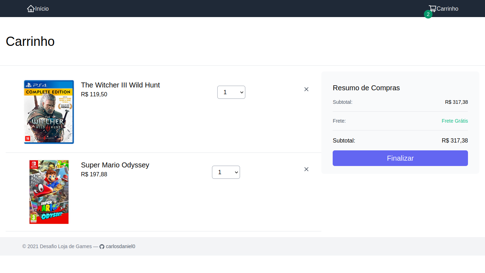

# Desadio E-Commerce

A construção de uma interface de e-commerce de games utilizando [ReactJS](https://pt-br.reactjs.org/)

## Imagens




## Início Rápido

Para utilizar esse projeto em sua máquina é necessário possuir o [NodeJS](https://nodejs.org/en/) v14+

```bash
    $ npm install

    $ npm run dev
```

> Acesse http://localhost:3000

## Tecnologias

- [x] [NextJs](https://nextjs.org/)
- [x] [ReactJs](https://pt-br.reactjs.org/)
- [x] [Tailwindcss](https://tailwindcss.com/)
